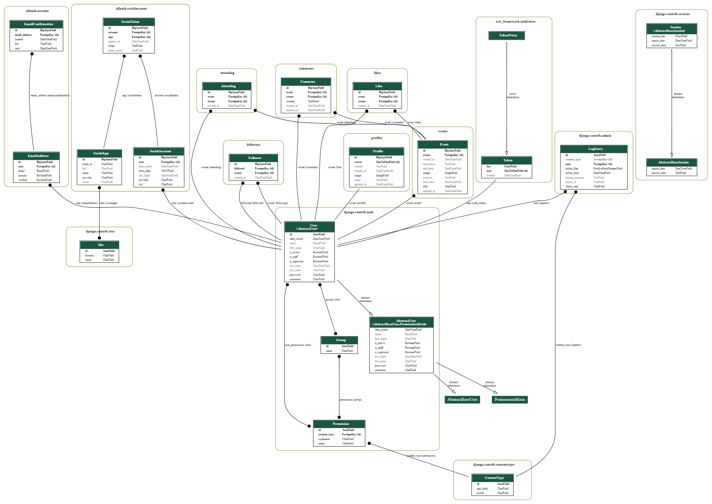

# Event API in DRF

**Developer: Stuart Wall**

💻 [Live link]()

This repository contains the API set up using Django REST Framework for the Tick It front-end application ([repository here]() and [live website here]())

## Table of Contents
  - [User Stories](#user-stories)
  - [Database](#database)
  - [Technologies Used](#technologies-used)
  - [Validation](#validation)
  - [Testing](#testing)
  - [Credits](#credits)

## User Stories

The back-end section of the project focuses on its administration side and covers a single user story:
- As admin, I want to be able to create, edit and delete users, events, comments, likes, attendance and followers; so that I can have complete control over the content of the application.  If necessary, I can remove any inappropriate content and add my own directly.

## Database

The following models were created to represent the database model structure of the application:

#### User Model
- The User model contains information about the user. It is part of the Django allauth library.
- One-to-one relation with the Profile model owner field
- ForeignKey relation with the Event model owner
- ForeignKey relation with the Comment model owner
- ForeignKey relation with the Like model owner
- ForeignKey relation with the Attending model owner
- ForeignKey relation with the Following model owner

#### Event Model
- The Event model contains information about a hosted event.
- owner: ForeignKey model with User.
- created_at: DateTime Field
- updated_at: DateTime Field
- title: Character Field
- description: Text Field
- location: Text Field
- start_time: DateTime Field
- end_time: DateTime Field
- image: Image Field

#### Comment Model
- The Comment model contains information about additional user posts on a specific event.
- owner: ForeignKey model with User.
- event: ForeignKey model with Event.
- created_at: DateTime Field
- updated_at: DateTime Field
- content: Text Field

#### Attending Model
- The Attending model contains information about users marking themselves as attending an event.
- owner: ForeignKey model with User.
- event: ForeignKey model with Event. Related name: 'attending'
- created_at: DateTime Field

#### Like Model
- The Attending model contains information about users 'liking' an event.
- owner: ForeignKey model with User.
- event: ForeignKey model with Event. Related name: 'likes'
- created_at: DateTime Field

#### Follower Model
- The Follower model contains information about users 'following' another user profile.
- owner: ForeignKey model with User. Related name: "following"
- owner: ForeignKey model with User. Related name: "followed"
- created_at: DateTime Field

#### Profile Model
- The Profile model contains information about a user.
- owner: ForeignKey model with User.
- created_at: DateTime Field
- updated_at: DateTime Field
- name: Character Field
- content: Text Field
- image: Image Field

##### Back to [top](#table-of-contents)

## Technologies Used

### Languages & Frameworks

- Python
- Django

### Libraries & Tools

- [Cloudinary](https://cloudinary.com/)
- [Graphviz](https://dreampuf.github.io/GraphvizOnline/)
- [Git](https://git-scm.com/)
- [GitHub](https://github.com/)
- [Gitpod](https://gitpod.io/workspaces)
- [Heroku](https://heroku.com)
- [Django REST Framework](https://www.django-rest-framework.org/)
- [Django AllAuth](https://django-allauth.readthedocs.io/en/latest/index.html)
- [Psycopg2](https://www.psycopg.org/docs/)
- [ElephantSQL](https://www.elephantsql.com/)

##### Back to [top](#table-of-contents)

## Validation

### Python Validation

PEP8 was unavailable at the time of creating this project so [Pycodestyle](https://pypi.org/project/pycodestyle/) was used instead to continually check all Python code for errors and warnings.
Additonally [PeP8CI] (https://pep8ci.herokuapp.com/#) was also used to validate the code.

## Testing

The following tests were carried out on the app:
1. Manual testing of user stories
2. Automated testing

### Manual testing of user stories

- As an admin, I want to be able to create, edit and delete the users, posts, comments and likes, so that I can have a control over the content of the application and remove any potential inappropriate content

**Test** | **Action** | **Expected Result** | **Actual Result**
-------- | ------------------- | ------------------- | -----------------
User | Create, update & delete user | A user can be created, edited or deleted | Works as expected
User | Change permissions | User permissions can be updated | Works as expected
Profile | Create, update & delete | User profile can be created, edited or deleted | Works as expected
Event | Create, update & delete | A Task can be created, edited or deleted | Works as expected
Comment | Create, update & delete | A comment can be created, edited or deleted | Works as expected
Follower | Create & delete |  A Follow relationship between Users can be created or deleted | Works as expected
Like | Create & delete | A Like can be created, edited or deleted | Works as expected
Attending | Create & delete | An Attending tag can be created or deleted | Works as expected

In addition, only logged in users can:
- Create/Update/Delete Events and Comments.
- Like/Unlike or Attend/Unattend events.
- Follow/ Unfollow other users.

Content can only be updated or deleted by their creators.

Screenshots - USER

    

Create user

      
      
      
    

    

Edit user

      
      
      
    

    

Delete user

      
      
      
    

Screenshots - PROFILE

    

Create profile

      
      
    

    

Edit profile

      
      
    

    

Delete profile

      
      
      
    

Screenshots - EVENT

    

Create event

      
      
      
    

    

Edit event

      
      
    

    

Delete event

      
      
      
    

Screenshots - COMMENTS 

    

Create comment 

      
      
      
    

    

Edit comment

      
      
    

    

Delete comment

      
      
      
    

### Automated testing

Automated testing was done using the Django Rest Framework APITestCase.

- Tests summary

Individual app report

Combined report

##### Back to [top](#table-of-contents)

## Credits

### Code

This project was created based on the Code Institute's Django REST API walkthrough project ['Moments'](https://github.com/Code-Institute-Solutions/drf-api).

##### Back to [top](#table-of-contents)